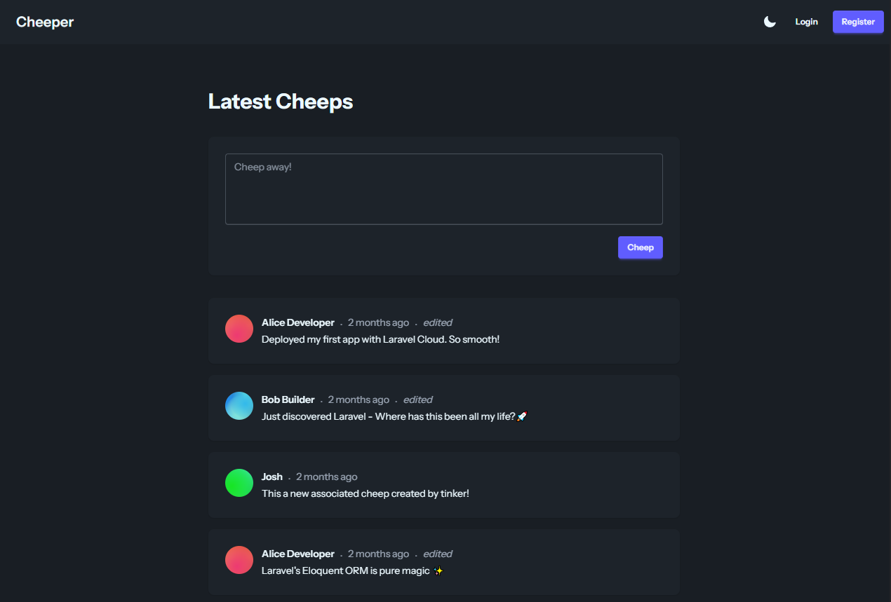
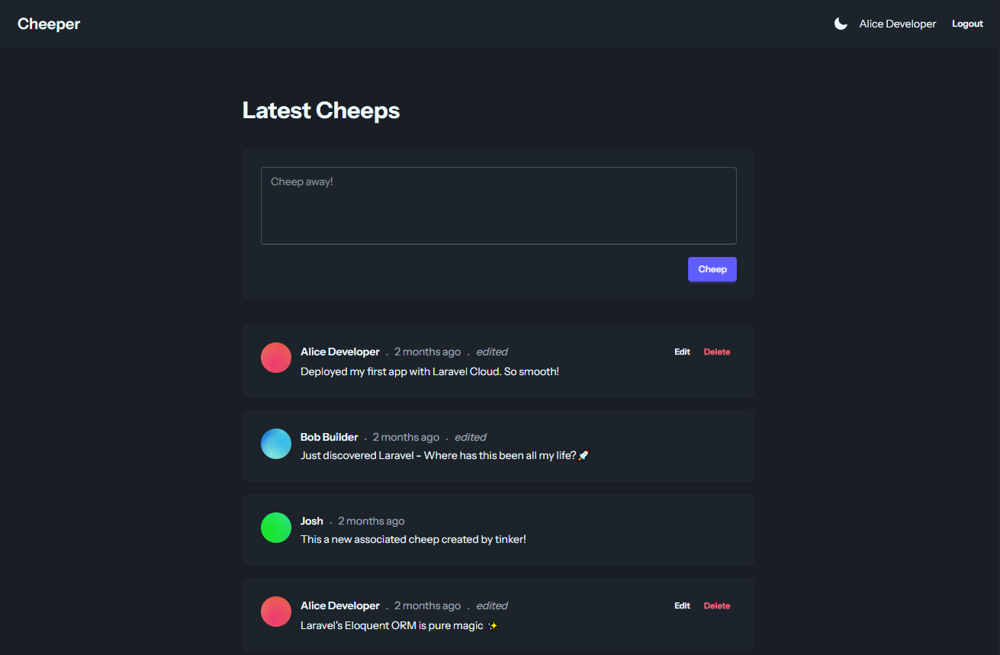
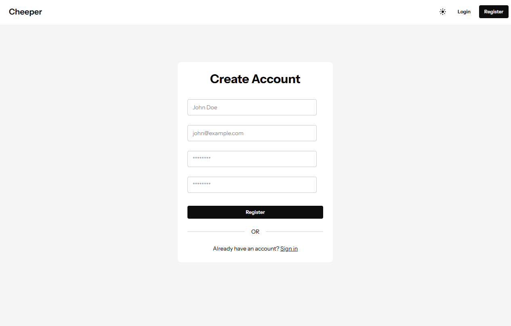

# Cheeper 🐤

A Twitter-style microblogging app where users post short 255-character messages called **Cheeps**. Built as a learning project on Laravel with server-rendered Blade views, it covers the full CRUD lifecycle, hand-rolled authentication, policy-based authorization, and a daisyUI interface with light/dark theming.



## Features

- **Public feed** — the home page shows the 50 latest cheeps from everyone, no login required.
- **Post cheeps** — authenticated users share messages up to 255 characters, validated on both the form and the database column.
- **Edit & delete your own cheeps** — owners get Edit/Delete controls on their cheeps; a `CheepPolicy` ensures no one can touch someone else's.
- **Authentication** — register, log in, and log out. Registration creates the account and signs the user in immediately.
- **Light & dark mode** — a sun/moon toggle in the navbar switches themes and remembers your choice; with no saved choice the app follows your operating system's preference.
- **Themed, playful UX** — friendly flash messages and validation copy (e.g. _"There is nothing to cheep about!"_).

### Manage your own cheeps

Logged-in users see Edit and Delete actions only on the cheeps they authored.



### Register an account



## Tech Stack

| Layer       | Technology                              |
| ----------- | --------------------------------------- |
| Backend     | Laravel 13, PHP 8.3                      |
| Frontend    | Blade, Tailwind CSS v4, daisyUI, Vite   |
| Database    | SQLite (default)                        |
| Testing     | Pest                                    |
| Formatting  | Laravel Pint                            |

## Getting Started

### Prerequisites

- PHP 8.3+ with Composer
- Node.js & npm

### Setup

```bash
# Clone the repository
git clone <repository-url>
cd cheeper

# Install dependencies, copy .env, generate an app key, migrate, and build assets
composer setup
```

### Run the dev environment

```bash
# Runs the PHP server, queue listener, and Vite together
composer dev
```

Then visit the URL printed by the server (typically <http://localhost:8000>).

You can also run the pieces individually:

```bash
php artisan serve   # PHP dev server
npm run dev         # Vite with hot reload
npm run build       # Production asset build
```

### Seed sample data (optional)

`CheepSeeder` creates sample users and cheeps. It is standalone and must be invoked explicitly:

```bash
php artisan db:seed --class=CheepSeeder
```

## Testing & Formatting

```bash
composer test                 # Run the Pest test suite
php artisan test --filter=Foo # Run a single test by name

./vendor/bin/pint             # Format code
./vendor/bin/pint --test      # Check formatting without making changes
```

Tests run against an in-memory SQLite database, separate from your local `database/database.sqlite`.

## How It Works

Cheeper follows a standard Laravel MVC structure built around two models — `User` and `Cheep` (one-to-many: a user has many cheeps).

- **Routing** (`routes/web.php`) — the public feed is open; cheep create/edit/update/delete are grouped behind `auth` middleware.
- **Auth** — hand-rolled (no Breeze/Jetpack). Each action (`Login`, `Logout`, `Register`) is its own invokable controller under `app/Http/Controllers/Auth/`.
- **Authorization** — `CheepPolicy` allows only a cheep's owner to update or delete it; the policy is auto-discovered by Laravel's naming convention.
- **Theming** — daisyUI is configured with a light (`lofi`) default and a `dark` theme that activates on system preference, plus a navbar toggle that persists the user's choice via `localStorage`.

## License

Open-sourced software licensed under the [MIT license](https://opensource.org/licenses/MIT).
